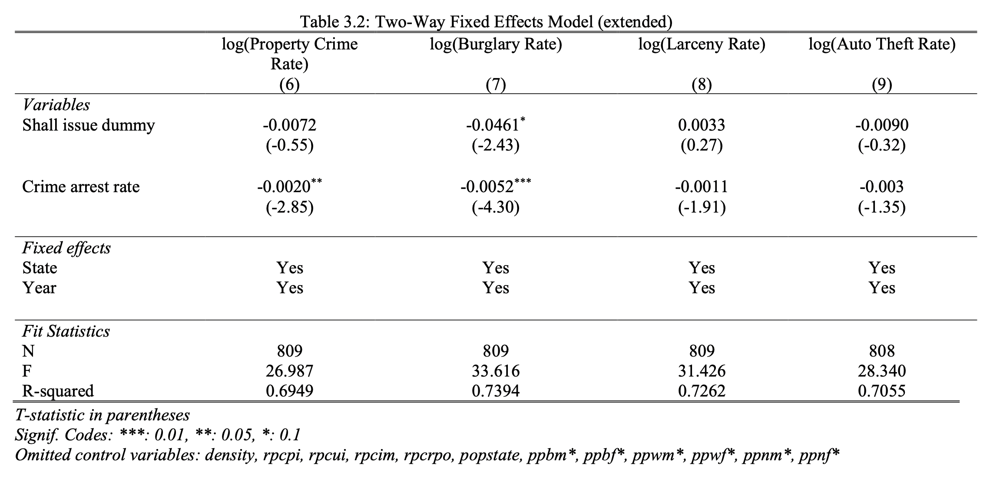

```{r setup, include=FALSE}
knitr::opts_chunk$set(fig.width=200, fig.height=300, fig.pos='H') 
source("source code/include.R", local = TRUE)
source("source code/CS_SA.R", local = TRUE)
library(knitr)
```

### 1  Introduction

This paper explores the Lott and Mustard 1997 study titled "Crime, Deterrence, and Right-to-Carry Concealed Handguns"^[Lott, Jr., John R., and David B. Mustard. “Crime, Deterrence, and Right‐to‐Carry Concealed Handguns.” The Journal of Legal Studies 26, no. 1 (1997): 1–68. https://doi.org/10.1086/467988.]. Specifically, this paper aims to replicate the 1997 analysis using state-level data and extend the causal inference methods using more modern techniques.  By comparing the 1997 results to what we find using state-level data and modern methodology, we can assess the validity and accuracy of the original study's findings. 
<br>

In their study, Lott and Mustard employed Twoway Fixed Effects (TWFE) models to control for bias in their estimates. This model provides important predictive power in causal inference studies exploring multiple groups across multiple years. However, new techniques provide a deeper understanding of the time and group effects at play within TWFE models. We extend the original study using three additional methods. First, we employ the Bacon Decomposition^[Goodman-Bacon, Andrew. 2019. “Difference-in-Differences with Variation in Treatment Timing.”], which dissects the different weights and pieces of the original coefficients. Then, we explore the Callaway and Sant'Anna^[B. Callaway and P.H.C. Sant’Anna, Difference-in-Differences with multiple time periods. Journal of Econometrics (2020), https://doi.org/10.1016/j.jeconom.2020.12.001] estimator and Sun and Abraham^[Liyang Sun, Sarah Abraham, Estimating dynamic treatment effects in event studies with heterogeneous treatment effects, Journal of Econometrics, Volume 225, Issue 2, 2021, Pages 175-199, ISSN 0304-4076, https://doi.org/10.1016/j.jeconom.2020.09.006] event study, which allow us to further analyze group-time average treatment effects and treatment effect heterogeneity. 

In the following sections, we review a brief background on the context and economic theory of the 1997 study before describing the data used in this replication. Then, we explore, in detail, the original methodology along with the three new techniques. Lastly, we conclude our findings and summarize how the new data and methods compare to the original study. 

### 2  Background and Economic Theory 

The 1997 study focused primarily on the impact of changes in concealed carry laws in the United States. Specifically, the authors explored how passing a concealed carry law may affect different crime rates in the United States. The authors used county-level data for 18 different states with information on arrest rates, crime rates,  and various demographic and economic information. The data also identified whether or not a state had an active "shall issue" law. The "shall issue" law requires officials to only issue concealed carry gun permits to individuals that passed basic criminal background and mental health screenings. This "shall issue" law is a useful indicator for change in concealed carry laws, therefore, the assigned treatment in this study was each state's rollout of the "shall issue" law. Table 1 shows when each state implemented the concealed carry law during the 1977-1992 time period. 

```{r, echo=FALSE, out.width = "35%", fig.align='center'}

```

The authors used TWFE models to mitigate bias across county and year. They regressed the natural log of various crime rates onto the shall issue binary indicator variable, each crime arrest rate, and various economic and demographic controls. The authors studied several different categories of crime, including: murder, rape, aggravated assault, robbery, burglary, larceny, and auto theft. Additionally, murder, rape, aggravated assault, and robbery were grouped into one category called "violent crimes", while burglary, larceny, and auto theft were grouped into "property crimes". This makes up a total of nine different crime categories that were included in this study. 

After estimating the effect of the shall issue law on each of the nine crime rates, the authors' main results found a negative effect for both violent crimes and property crimes. These results imply that concealed carry laws are correlated with less overall crime in the United States. 

### 3  Data 
The data used for this study includes information on the same 18 states as the original study, just at the state level. In addition to each state's shall issue law, the data includes crime and arrest rates for each of the nine crime categories, as well as economic and demographic information such as population, income, age, gender, and race. Because this data is at the state level, there are less observations than the original study. However, the average sample size for each variable is about 800, which should be sufficient to provide accurate results. 

Table 2.1 summarizes the average crime rates and arrest rates for each crime category. Additionally, this table summarizes average population and economic characteristics, such as population density, personal income, and unemployment insurance. We can see the most common crimes, based on average crime rates, tend to be property crimes. Specifically, larceny and burglary are the most common crimes committed in this data. 

```{r, echo=FALSE, out.width = "90%", fig.align='center'}

```


Table 2.2 summarizes the remaining demographic information on age, race, and gender. We can see that, on average, the highest population group is comprised of white males and females between the ages 20-29. 
```{r, echo=FALSE, out.width = "90%", fig.align='center'}

```


### 4  Empirical Model and Estimation
This section explores in detail the advantages and limitations of each estimation technique. First, we analyze the TWFE model employed in the original study. Then, we explore the three new methods: Bacon Decomposition, Callaway and Sant'Anna estimator, and Sun and Abraham event study.  

### 4.1  Twoway Fixed Effects 
The TWFE model works to mitigate bias across multiple groups over multiple years. For this replication study, our model specification is as similar to the original study as possible. We regress the natural log of each crime rate onto its respective arrest rate and the remaining demographic control variables, while controlling for state and year effects^[See Appendix 6.1 for full regression output]. The main difference between this model and original model, is we use state data instead of county data. 

Table 3 summarizes the results with the main coefficients of interest. 
```{r, echo=FALSE, out.width = "55%", fig.align='center'}

```

Similar to the original study, all coefficients, except for larceny, had an estimated negative relationship with the shall issue law. However, the only coefficients that were estimated at a significant level were violent crime, aggravated assault, and burglary. The two coefficients with the highest magnitude are aggravated assault and violent crime, about -0.1000 and -0.098, respectively. This implies that concealed carry laws may have the largest and most significant impact on reducing the rate of aggravated assault and violent crimes.

### 4.2  Bacon Decomposition
The Bacon Decomposition provides a deeper understanding of the different weights and parts of the TWFE estimator. The TWFE coefficient is a weighted average of all potential 2x2 DD estimates, which are based on group size and variance. The TWFE estimator is a weighted average of all possible ATTs, under the assumption of variance weighted common trends (VWCT) and time invariant treatment effects. However, when there are in fact time-variant treatment effects (as in this study) the TWFE estimator may be severely biased. 

The Bacon Decomposition breaks down the TWFE estimator into the different 2x2 coefficients for each comparison group, and provides weights to each group. The TWFE estimator ultimately aggregates over these weights and coefficients to output the one coefficient we see. Therefore, the TWFE coefficient relies on group variation to calculate its parameter. 

It is important to note that none of the Bacon Decompositions in this study include controls, so the coefficient estimates won't directly reflect the coefficients seen in Table 3. 

Table 4.1 shows the Bacon Decomposition for the violent crime rate TWFE coefficient. We can see that the Treated vs. Untreated group has an estimate of about -0.112 and has the largest weight, making up about 75% of the total estimator. From these estimates and weights (despite not including controls), we can better understand how the TWFE coefficient was calculated. 

However, the Later Treatment vs. Earlier Comparison group presents a potential problem in the 2x2 Bacon Decomposition. This group relies on the assumption of parallel trends and homogeneous treatment effects across time for the earlier treated group. This assumption often won't hold when considering differential treatment effects.  Thankfully, this 2x2 group only makes up about 2% of the TWFE estimator, so it may only present a marginal amount of bias. 
```{r, echo=FALSE, out.width = "60%", fig.align='center'}

```

Table 4.2 shows the Bacon Decomposition for the murder crime rate TWFE coefficient^[See Appendix 6.2 for remaining Bacon Decompositions]. Note that the group weights remain the same in each decomposition, because they are dependent on groups over a specific time period. Because all coefficients are estimated over the same time period, the group weights remain the same. Therefore, the Treated vs. Never Treated group once again has the largest weight with an estimate of about -0.056. 
```{r, echo=FALSE, out.width = "60%", fig.align='center'}

```

### 4.3  Callaway and Sant’anna
Another approach to solving the weighting problem of the TWFE estimator, is the Callaway and Sant'Anna estimator. This approach estimates group-time average treatment effects, which is just the ATT for a given group at any point in time. However, this group-time ATT assumes parallel trends conditional on time-invariant covariates and weights. Because this approach calculates group ATT by time, you can end up with several treatment effect parameters in each group. Callaway and Sant'Anna solves this issue by taking all of the treatment effects and collapsing them into one interpretable parameter for each group. 

Table 5 shows these collapsed overall ATTs for each group. Some of these estimates are significantly different than the initial TWFE estimates we found. For example, the violent crime rate estimate went from about -0.098 to about -0.010, which is almost a tenth of the initial magnitude. Moreover, many parameters switched signs from their initial TWFE. For example, the estimate for the rape crime rate went from about -0.034 to about 0.013. 

```{r, echo=FALSE, out.width = "55%", fig.align='center'}

```

These large changes in magnitude and direction illuminate the importance of group-time treatment effects, and how vastly they can differ from the original TWFE estimates. Moreover, the significant changes in the Callaway and Sant'Anna estimates could be due to a violation of the parallel trends assumption, which would greatly bias our estimates.

### 4.4  Event Study: Sun and Abraham
For our third model extension, we explore how Sun and Abraham address some of the biases brought on by heterogeneous treatment effects. Specifically, we explore how Sun and Abraham address some of the issues caused by event studies with differential timing. 

As previously uncovered in the Bacon Decomposition and the Callaway and Sant'Anna estimator, leads and lags are often used to measure the treatment in an event study with differential timing. However, these can produce causally uninterpretable results if there are heterogeneous treatment effects over time. So, the Sun and Abraham event study figures help us visualize if the pretrends assumption holds and the average treatment effets over time. 

We use the Sun and Abraham function on treatment year and year for each outcome variable, and we include state and year fixed effects controls in our models^[See Appendix 6.3 for remaining Sun and Abraham figures]. Figure 1 shows the event study figure for the violent crime rate. We can see that the pre-treatment estimates are statistically different than zero for most of the pre-treatment period, which implies the pretrend assumptions do not hold for this model. Meanwhile, the post-treatment estimates are only statistically different than zero for a couple years after treatment before returning to zero. These results provide come concerns to the validity and longevity of the treatment effect for violent crimes. 

```{r, echo=FALSE, fig.cap = "Sun and Abraham: log(Violent Crime Rate)", out.width = "75%", fig.align='center'}

```

```{r, echo=FALSE, fig.cap = "Sun and Abraham: log(Murder Rate)",out.width = "70%", fig.align='center'}

```

Figure 2 shows the Sun and Abraham event study for the murder rate. Unlike Figure 1, there does appear to be evidence of pretrend assumptions holding, as most of the pre-treatment estimates are not statistically different than zero. However, the post-treatment period experiences only a brief treatment effect, similar to that in Figure 1. It appears that there is no statistically significant effect for the first couple years after treatment, then there is a significant treatment effect for a few years before returning to zero again. Once again, this trend raises concern for the longevity of these treatment effects. 


### 5  Conclusion
In their 1997 study, Lott and Mustard developed a TWFE model to identify the effect of concealed carry gun laws on various crime rates in the United States. In an effort to compare and extend their results, we replicated their original TWFE model using state-level data. Then, we extended their analysis with three more modern approaches. First, we used the Bacon Decomposition to break down the TWFE coefficient into different comparison groups and developed a deeper understanding of the TWFE coefficient composition. Next, we calculated Callaway and Sant'Anna estimators to better understand the group-time average treatment effects. Lastly, we employed the Sun and Abraham event study to better understand the average treatment effect over time and identify potential bias from heterogeneous treatment effects. 

While our replicative TWFE model found similar results as the original study, the three additional models provided further insight to the validity of the TWFE estimates. In studies regarding differential timing and potential heterogeneous treatment effects, it is important to understand the effect of leads and lags and group-time treatment effects. These sources of bias can confuse the true causal implications of treatments, so it is important to be vigilant in identifying potential sources of bias. Moreover, this study brings to light the effectiveness of using several different models. Each model has its own strengths and weaknesses in identifying treatment effects and biases. Therefore, employing a few different models can bring strengths in each area of weakness, and provide a fuller understanding of the true treatment effects and causal implications.

\newpage

### 6  Appendix

#### 6.1  Twoway Fixed Effects: Extended Regression Output

```{r, echo=FALSE, out.width = "85%", fig.align='center'}

```

```{r, echo=FALSE, out.width = "85%", fig.align='center'}

```

\newpage

#### 6.2  Bacon Decomposition: Remaining Tables

```{r, echo=FALSE, out.width = "60%", fig.align='center'}
include_graphics("figures/table4.3.png")
```

```{r, echo=FALSE, out.width = "60%", fig.align='center'}

```

```{r, echo=FALSE, out.width = "60%", fig.align='center'}

```

```{r, echo=FALSE, out.width = "60%", fig.align='center'}

```

```{r, echo=FALSE, out.width = "60%", fig.align='center'}

```

\newpage

```{r, echo=FALSE, out.width = "60%", fig.align='center'}

```

```{r, echo=FALSE, out.width = "60%", fig.align='center'}

```

#### 6.3  Sun and Abraham: Remaining Figures

\newpage

```{r, echo=FALSE, fig.cap = "Sun and Abraham: log(Rape Rate)", out.width = "75%", fig.align='center'}

```

```{r, echo=FALSE, fig.cap = "Sun and Abraham: log(Aggravated Assault Rate)", out.width = "75%", fig.align='center'}

```

```{r, echo=FALSE, fig.cap = "Sun and Abraham: log(Robbery Rate)", out.width = "75%", fig.align='center'}

```

```{r, echo=FALSE, fig.cap = "Sun and Abraham: log(Property Crime Rate)", out.width = "75%", fig.align='center'}

```

```{r, echo=FALSE, fig.cap = "Sun and Abraham: log(Burglary Rate)", out.width = "75%", fig.align='center'}

```

```{r, echo=FALSE, fig.cap = "Sun and Abraham: log(Larceny Rate)", out.width = "75%", fig.align='center'}

```

```{r, echo=FALSE, fig.cap = "Sun and Abraham: log(Auto Theft Rate)", out.width = "75%", fig.align='center'}

```


